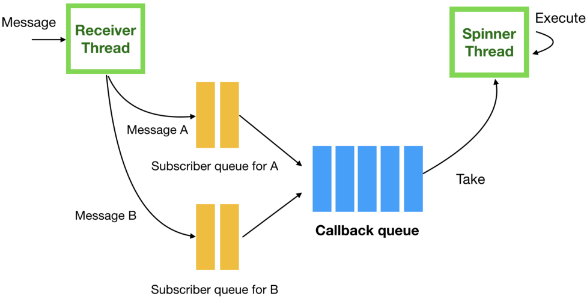
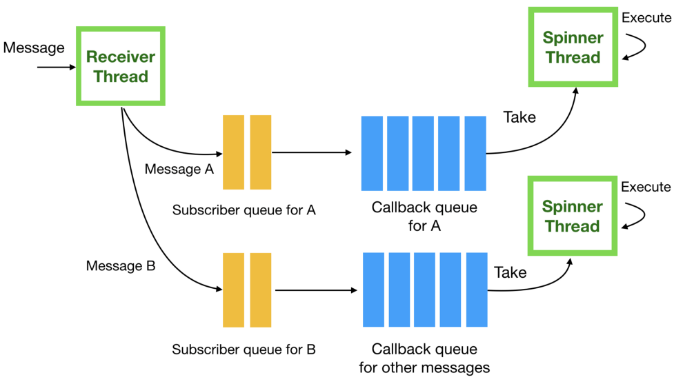

# ROS Multithreading

This repository is currently undergoing construction. Please come back again later.  

In ROS there are two types of objects handling callbacks:

- Spinner
- Callback Queue

**Spinner:** Spinner object has the ability to call callback message contained in a callback queue.  
**Callback Queue:** Callback queue object appends an callback message to its queue.  

An ordinary ROS node with two subscribers.  

Regarding to spinners, currently there are three implementation in ROS.

- [**Single Thread Spinner**](http://ros.org/doc/groovy/api/roscpp/html/classros_1_1SingleThreadedSpinner.html): This is the default implementation and mostly used for the tutorials. This method takes callback message inside of a callback queues and process each callback messages one by one while blocking the executioin of the thread (main thread) that calls it.
- [**Multi-Threaded Spinner**](http://ros.org/doc/groovy/api/roscpp/html/classros_1_1MultiThreadedSpinner.html): This method spawns configurable number of threads that will execute callbacks messages in parallel when they are recieved, but it will blocks the execution of the thread (main thread) that calls it. Note that one specify callback message can be processed at a time. Please refer to this [explanation](https://levelup.gitconnected.com/ros-spinning-threading-queuing-aac9c0a793f). `# allow_concurrent_callbacks`
- [**Asynchronous Spinner**](http://ros.org/doc/groovy/api/roscpp/html/classros_1_1AsyncSpinner.html): This method spawns configurable number of threads that will execute callback messages in parallel when recieved, however, unlike the previous one, this method does **not** block the thread (main thread) that calls it. The start/stop method allows the control of when callback messages starts or stops the process. 

## Multiple Spinners

Allowing multiple spinners (threads) to preform on callback messages in callback queue.

## Multiple Callback Queues and Multiple Spinners

This method is generally preferred. Having multiple callback queues and spinners (threads) to handle each callback queue.

A ROS node with multiple callback queues and spinners.  

## MultiThreading for Publisher

If it has never occurred to you that you need multi threading ROS publisher, you can actually do it. Please refer to [gazebo-plugin-ros](https://github.com/BruceChanJianLe/gazebo-plugin-ros) for more information.

## Reference

- http://wiki.ros.org/roscpp/Overview/Callbacks%20and%20Spinning
- https://answers.ros.org/question/56275/suggest-good-example-of-multi-threading-with-ros/
- https://answers.ros.org/question/53055/ros-callbacks-threads-and-spinning/
- https://answers.ros.org/question/185153/ros-multithreading-example/
- https://roboticsbackend.com/ros-asyncspinner-example/
- https://levelup.gitconnected.com/ros-spinning-threading-queuing-aac9c0a793f
- https://nicolovaligi.com/concurrency-and-parallelism-in-ros1-and-ros2-application-apis.html

